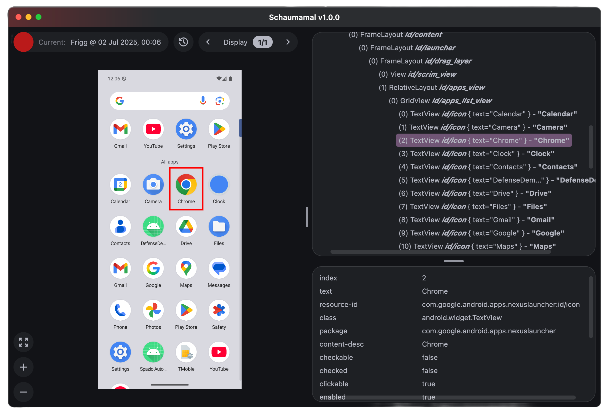

#### 🎉🎊 Schaumamal is finally stable! Download the latest version [here](https://github.com/vladcudoidem/Schaumamal/releases/latest).
 

    

# Schaumamal

Schaumamal (pronounced SHAU-muh-MAAL) is a **lightweight, cross-platform layout inspector** for Android devices. It's meant to be a successor to the
old and retired UiAutomatorViewer. Schaumamal's central features are its **dump history** and **multi-display support**.
Its fresh UI and better UX are also a plus.

 

# 🎯 Who and what is it for?

Android Studio already has a powerful Layout Inspector. Why would anyone use this instead? There are two main reasons.

1. The Android Studio Layout Inspector requires a debuggable process to inspect the application layout. But that isn't
always available or easy to produce. For example, QA engineers that write Appium tests for Android applications/systems greatly profit
from a layout inspector that lifts this requirement.

1. While the Android Studio Layout Inspector works wonderfully with standard Android emulator images, some custom
images create difficulties and sometimes completely prohibit it from working. From my experience, Schaumamal is not
affected by this.

As such, Schaumamal can be a useful addition to the toolbox of both an **Android QA engineer** and an **Android developer**.

# 📖 Quick showcase

The application has a simple UI that should look familiar to users of other layout inspectors.
At the center of the application is the _screenshot_ of the currently selected display.

Starting from the top left, the most important element is the _red dump button_. It is followed by some information
about the current dump and a button that opens the _dump history pane_. After that, there's a _display control pill_
with two buttons for switching between displays.

    

 

The dump history pane displays the last 15 dumps. Click on any of them to inspect it again.

    

 

In the bottom left corner, there are three buttons for screenshot control: _fit-to-screen_, _enlarge_ and _shrink_.

    

On the right side, there are two panes. The upper pane shows the _UI element tree_ for the currently selected display.
The lower pane shows _all properties_ for the selected UI element. Click on the value of any property to copy its text.

    

# 🔧 How does it work?

Under the hood, Schaumamal uses the `uiautomator dump --windows` command, which dumps the display contents into an XML file.
The screenshots are taken using the `screencap` command. A confusing algorithm then matches the screenshots to the
contents of the XML dump and out comes the usable information displayed on your screen.

Thus, really the only requirement is an ADB connection to an Android device.

# ⚠️ Known problems

Ideally, this list would not be needed. But currently, you might encounter the following problems:

## Running Appium server

Sometimes, when using Schaumamal while an Appium server is running, the ADB connection fails.

The most reliable solution currently is to temporarily stop the Appium server before dumping the screen content with Schaumamal. After
that, the Appium server can be started again.

## Corrupt files

Although it happens extremely rarely, sometimes the files that Schaumamal uses to store the dump information
(screenshots, XML files and some metadata) are corrupt. The result is an immediate failure when launching the
application (the error message would most likely be `Failed to launch JVM`).

_(Proceed with caution. Incorrectly following the next instructions can lead to all the recorded dump data being
deleted!)_ To solve this, you can first back up the dump data (e.g., copy and paste it at some secure location) and
then remove it from the application directory:

- on **MacOS**, the directory lies at `~/Library/Application Support/Schaumamal`,
- on **Windows**, the directory lies at `~/AppData/Local/Schaumamal`,
- on **Linux**, the directory lies at `~/.schaumamal`.

Schaumamal will rebuild a clean file structure and the error should go away.

# 🚧 Upcoming features

There are a lot of planned features in sight. They include:

- search functionality for the UI element tree,
- a settings pane (for customizing stuff like max. dump history entries and the screenshot matching algorithm),
- making the UI element tree nodes collapsable,
- and much more!

# 🚨 Bug reports and feature requests

Do not hesitate to create a GitHub Issue if you encounter any bugs or would like to make a feature request.
All feedback is highly appreciated! Or...

# 💪🏼 Contributing

If you would like to fix a problem or add a feature yourself, you are welcome to contribute to the project.
This is open-source, after all. I'll be happy to help where needed ☺️.
